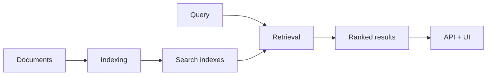
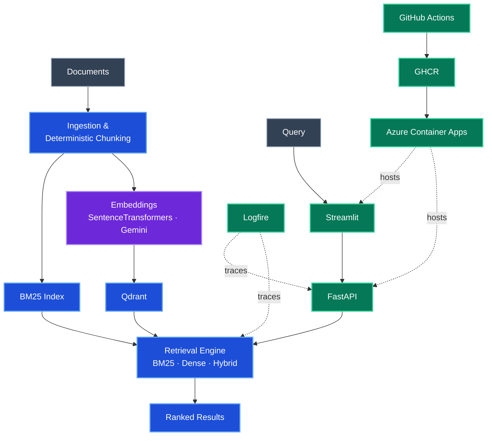

<p align="center">
  <a href="https://signalrank-ui.icybeach-127c89e3.northeurope.azurecontainerapps.io">
    
  </a>
</p>

# SignalRank-RAG

**Reproducible retrieval, from documents to ranked results.**

SignalRank-RAG is an open-source retrieval system for building, comparing, evaluating, and operating lexical, semantic, and hybrid retrieval for RAG.

[](https://github.com/bksampadi/SignalRank-RAG/actions/workflows/ci_cd.yml)

[](https://github.com/bksampadi/SignalRank-RAG/releases)


[Live API docs](https://signalrank-api.icybeach-127c89e3.northeurope.azurecontainerapps.io/docs) · [Health](https://signalrank-api.icybeach-127c89e3.northeurope.azurecontainerapps.io/health)

> The first request may take a few seconds if Azure Container Apps has scaled to zero.

The live UI lets you compare BM25, dense, and hybrid retrieval and submit per-result relevance feedback. Underneath it, the same deterministic chunks, retrieval service, evaluation code, and containerized application are used across local development and deployment.

---

## How it works



Documents are processed into a shared deterministic representation and indexed for lexical and semantic search. At query time, the same retrieval service can run BM25, dense vector search, or hybrid fusion.

---

## System Stack

Node colour indicates engineering role: purple for AI/ML, blue for RAG/retrieval, and green for platform/software engineering.



The same deterministic chunks feed sparse and dense retrieval. Embedding providers are replaceable, Qdrant can run locally or remotely, and the deployed application uses the same FastAPI service boundary as local execution.

---

## Adversarial Retrieval Benchmark

The committed benchmark contains **39 documents and 30 labelled queries** designed to stress lexical and semantic retrieval under difficult ranking conditions.

<p align="center">
  
</p>

| Mode | Hit@1 | MRR@5 |
| --- | ---: | ---: |
| BM25 | 0.433 | 0.590 |
| Dense | **0.567** | **0.756** |
| Hybrid | 0.467 | 0.653 |

Dense retrieval performs best overall and reaches **Hit@5 = 1.000**: the relevant document is present somewhere in the top five for every benchmark query. On this benchmark, the remaining dense-retrieval gap is therefore primarily a ranking problem.

BM25 still contributes top-1 wins that dense retrieval misses:

`Both correct: 11` · `BM25 only: 2` · `Dense only: 6` · `Both wrong: 11`

The BM25 × Dense oracle reaches **Hit@1 = 0.633**, while top-1 agreement is **0.567**.

Naive hybrid fusion does not automatically improve ranking quality despite this complementarity. The current hybrid implementation is therefore a baseline, not a claimed improvement. This motivates the next work on retrieval diagnostics, improved fusion, reranking, and relevance calibration.

### Reproduce the benchmark

The corpus, labelled queries, configuration, indexing path, evaluation code, and benchmark runner are committed to the repository.

```bash
uv sync --extra eval
uv run --locked python scripts/index_corpus.py --config configs/benchmark.yaml --recreate
uv run --locked python scripts/benchmark_retrieval.py
```

The benchmark configuration pins `sentence-transformers/all-mpnet-base-v2`, chunking, retrieval depth, fusion settings, corpus path, and the benchmark Qdrant collection. The model must be available locally or downloaded on first use.

---

## Quick Start

Run the local stack with Docker Compose:

```bash
docker compose up --build
```

Then open:

- Streamlit: `http://localhost:8501`
- FastAPI docs: `http://localhost:8000/docs`
- Health: `http://localhost:8000/health`

The API exposes:

```text
GET  /health
POST /retrieve
```

`POST /retrieve` supports `bm25`, `dense`, and `hybrid` modes. The retrieval endpoint is protected by the `X-SignalRank-Service-Token` header; the Streamlit UI supplies the token when calling the API. `/health` remains available for liveness checks.

Requests are constrained to a maximum 500-character query and `top_k` between 1 and 10.

---

## Development

SignalRank-RAG uses [`uv`](https://docs.astral.sh/uv/) with a committed lockfile.

```bash
# Install
uv sync --extra eval

# Tests
uv run --locked python -m pytest -v

# Quality checks
uv run --locked ruff check .
uv run --locked ruff format --check .
uv run --locked pyright
```

Run the services directly:

```bash
uv run uvicorn signalrank.api.main:app --reload
uv run streamlit run src/signalrank/ui/app.py
```

By default, Streamlit expects the API at `http://127.0.0.1:8000`. Override it with `SIGNALRANK_API_URL`.

---

## Configuration

Application behavior is configured through YAML.

```yaml
chunking:
  chunk_size: 1000
  chunk_overlap: 200

embedding:
  provider: sentence_transformer
  model_name: sentence-transformers/all-mpnet-base-v2

retrieval:
  top_k: 5

qdrant:
  mode: local
  collection_name: signalrank_finewiki
  path: data/qdrant
```

Qdrant can run in memory, persist locally, or connect to a remote/Qdrant Cloud instance. Deployment endpoints and credentials are supplied through environment variables and platform-managed secrets rather than committed YAML.

Common deployment variables include:

```text
GEMINI_API_KEY
QDRANT_URL
QDRANT_API_KEY
LOGFIRE_TOKEN
SIGNALRANK_API_URL
SIGNALRANK_SERVICE_TOKEN
```

---

## Relevance Feedback

The live Streamlit UI lets users mark individual results as **Relevant** or **Not relevant**.

Feedback is currently collected as retrieval-evaluation data rather than used to change rankings online. Each judgement can be associated with the search/session context and result metadata, providing labelled evidence for future retrieval diagnostics, threshold calibration, fusion experiments, and reranking.

---

## Observability

SignalRank-RAG uses Logfire for distributed tracing across FastAPI, retrieval, embedding, Qdrant, and relevance-feedback events.

Routine retrieval spans capture operational metadata such as retrieval mode, embedding provider and dimension, collection, workload size, and execution timing. When relevance feedback is submitted, the associated query and result metadata may be logged for retrieval evaluation; the public UI therefore asks users not to enter sensitive information.

Logfire is optional; the application can run without Logfire credentials.

---

## CI and Deployment

The repository has **57 automated tests** and a GitHub Actions matrix across Python 3.11–3.13 on Ubuntu and Windows. CI includes pytest, Ruff linting and formatting checks, Pyright, and a Docker smoke test.

Merges to `main` pass the quality gates before a container image is published to GHCR and deployed to Azure Container Apps.

```text
GitHub
   ↓
GitHub Actions
   ↓
CI / quality gates
   ↓
GHCR
   ↓
Azure Container Apps
   ├── FastAPI
   └── Streamlit
          ↓
      Qdrant Cloud
```

The deployment workflow publishes immutable commit-SHA images, authenticates to Azure through OIDC, updates both application services, verifies the deployed revisions, and checks that the public UI is reachable.

Runtime endpoints and secrets are injected through deployment configuration rather than stored in the repository.

---

## Project Structure

```text
SignalRank-RAG/
├── .github/workflows/        # CI/CD
├── benchmarks/retrieval/     # corpus, queries, ground truth
├── configs/                  # application and benchmark configuration
├── scripts/                  # indexing and benchmark runners
├── src/signalrank/
│   ├── api/                  # FastAPI and request validation
│   ├── components/           # ingestion, embeddings, retrieval, Qdrant
│   ├── evaluation/           # retrieval metrics
│   ├── observability/        # Logfire
│   ├── pipelines/            # indexing and retrieval workflows
│   ├── services/             # application services
│   └── ui/                   # Streamlit and relevance feedback
├── tests/
├── compose.yaml
├── Dockerfile
├── pyproject.toml
└── uv.lock
```

---

## Roadmap

- [x] Hybrid retrieval
- [x] Retrieval evaluation framework
- [x] Adversarial retrieval benchmark
- [x] Multi-provider embeddings
- [x] Per-result relevance feedback
- [x] API service-token protection and request limits
- [x] Containerized API and UI
- [x] Public Azure deployment
- [x] Automated GHCR publishing and Azure deployment
- [ ] Retrieval diagnostics
- [ ] Relevance / abstention calibration
- [ ] Improved fusion
- [ ] Reranking
- [ ] Embedding-model comparison
- [ ] Larger and domain-specific retrieval benchmarks
- [ ] Retrieval quality gates in CI

---

## License

SignalRank-RAG is released under the MIT License. See [`LICENSE`](LICENSE).
