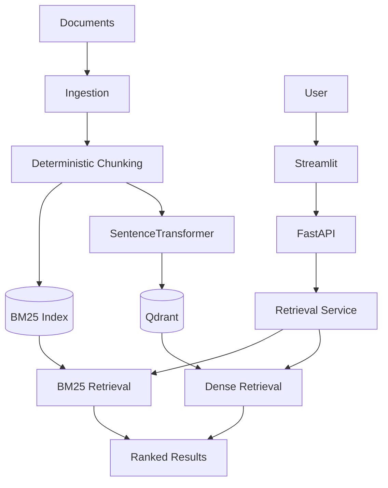

# SignalRank-RAG

[](https://github.com/bksampadi/SignalRank-RAG/actions/workflows/ci.yml)

**Current release: `v0.1.0`**

SignalRank-RAG is an open-source framework for building and evaluating Retrieval-Augmented Generation (RAG) systems.

`v0.1.0` establishes a reproducible retrieval foundation with deterministic ingestion, lexical and semantic retrieval, vector search, API and UI layers, observability, testing, and containerized execution.

The project focuses on:

- Document ingestion
- Chunking strategies
- Embedding pipelines
- Lexical and semantic retrieval
- Vector search
- Reranking
- Evaluation
- Observability
- Containerized deployment

## Architecture



## Currently Implemented

### Ingestion and provenance

- Recursive TXT and Markdown ingestion
- Structured DOCX, PPTX, and XLSX ingestion
- Portable relative source references
- Deterministic, content-sensitive document IDs
- Preservation of document and element provenance

### Chunking and embeddings

- Deterministic chunking with configurable overlap
- Embedding provider abstraction
- SentenceTransformer embedding provider

### Retrieval

- BM25 lexical retrieval
- Dense semantic retrieval
- Qdrant vector store integration
- Shared retrieval interface
- Ranked search result model
- Retrieval service supporting BM25 and dense modes

### Application layer

- FastAPI retrieval API
- Health endpoint
- Retrieval endpoint
- Streamlit retrieval interface

### Engineering

- Distributed observability and tracing with Logfire
- Reproducible dependency management with `uv`
- Docker containerization
- Docker Compose orchestration
- Automated CI across Linux and Windows
- 35 automated tests

## Quick Start with Docker

The simplest way to run SignalRank-RAG is with Docker Compose.

```bash
docker compose up --build
```

Then open:

- **Streamlit UI:** `http://localhost:8501`
- **FastAPI documentation:** `http://localhost:8000/docs`
- **Health endpoint:** `http://localhost:8000/health`

The Compose setup runs the Streamlit UI and FastAPI retrieval service as separate services.

Logfire telemetry is optional. SignalRank-RAG runs without Logfire credentials and sends telemetry only when valid Logfire configuration is available.

## Development Setup

SignalRank-RAG uses `uv` for Python environment and dependency management.

Install dependencies:

```bash
uv sync --extra eval
```

Run the test suite:

```bash
uv run pytest -v
```

Run the FastAPI service:

```bash
uv run uvicorn signalrank.api.main:app --reload
```

Run the Streamlit UI in a second terminal:

```bash
uv run streamlit run src/signalrank/ui/app.py
```

By default, the Streamlit UI expects the retrieval API at:

```text
http://127.0.0.1:8000
```

This can be overridden with the `SIGNALRANK_API_URL` environment variable.

Continuous integration currently tests:

- Python 3.11–3.13 on Ubuntu
- Python 3.11 on Windows

## Observability

SignalRank-RAG uses Logfire for structured and distributed tracing across the retrieval path.

The current tracing baseline covers:

```text
Streamlit retrieval interaction
        ↓
HTTP request
        ↓
FastAPI retrieval endpoint
        ↓
Retrieval operation
```

Manual retrieval spans record operational metadata such as retrieval mode, `top_k`, query length, and session identifier.

HTTP and FastAPI instrumentation provide request timing, status, and distributed trace context.

Raw query text is not intentionally attached to SignalRank-RAG's manual telemetry spans.

## v0.1.0

`v0.1.0` establishes the baseline retrieval substrate for SignalRank-RAG.

It includes:

- Deterministic ingestion
- Structured document loading
- Provenance preservation
- Deterministic chunking
- SentenceTransformer embeddings
- BM25 retrieval
- Dense retrieval
- Qdrant vector storage
- FastAPI service layer
- Streamlit interface
- Distributed tracing
- Automated testing and CI
- Docker
- Docker Compose

Future releases will extend this foundation with additional retrieval, ranking, and evaluation capabilities.

## Roadmap

- [x] Project scaffold
- [x] Exception handling
- [x] Configuration management
- [x] Data ingestion
- [x] Structured Office document ingestion
- [x] Deterministic chunking
- [x] Embedding provider abstraction
- [x] SentenceTransformer embedding baseline
- [x] BM25 lexical retrieval
- [x] Qdrant vector store
- [x] Dense retrieval
- [x] FastAPI retrieval API
- [x] Streamlit interface
- [x] Distributed observability and tracing
- [x] Docker containerization
- [x] Docker Compose orchestration
- [ ] Hybrid retrieval
- [ ] Reranking
- [ ] Evaluation framework
- [ ] Retrieval diagnostics
- [ ] Public API deployment