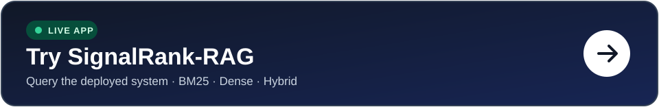
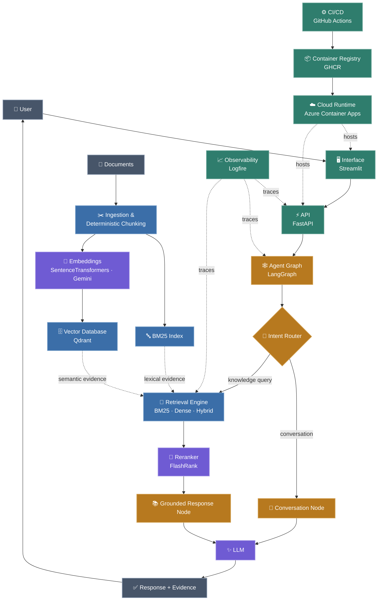
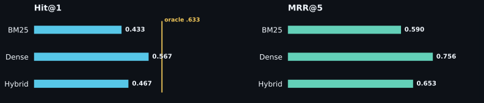

<p align="center">
  <a href="https://signalrank-ui.icybeach-127c89e3.northeurope.azurecontainerapps.io">
    
  </a>
</p>

# SignalRank-RAG

**Reproducible retrieval, reranking, and grounded responses.**

SignalRank-RAG is an open-source, production-oriented RAG system for building and inspecting the path from documents to evidence-backed answers.

It combines deterministic ingestion, lexical and semantic retrieval, hybrid fusion, second-stage reranking, agentic routing, grounded LLM responses, evaluation, observability, and automated cloud deployment.

[](https://github.com/bksampadi/SignalRank-RAG/actions/workflows/ci_cd.yml)

[](https://github.com/bksampadi/SignalRank-RAG/releases)


[Live API docs](https://signalrank-api.icybeach-127c89e3.northeurope.azurecontainerapps.io/docs) · [Health](https://signalrank-api.icybeach-127c89e3.northeurope.azurecontainerapps.io/health)

> The first request may take a few seconds if Azure Container Apps has scaled to zero.

The retrieval UI remains intentionally inspectable: users can compare BM25, dense, and hybrid retrieval and submit per-result relevance feedback. The application layer now also supports agentic routing and grounded response generation on top of the retrieval and ranking stack.

---
## How SignalRank Answers a Query

SignalRank-RAG uses a small explicit graph rather than treating every request as retrieval.

```text
START
  ↓
Intent Router
  ├── conversation
  │      ↓
  │  Conversation Node
  │      ↓
  │     LLM
  │
  └── knowledge query
         ↓
      Search Service
         ↓
   retrieve + rerank
         ↓
 Grounded Response Node
         ↓
        LLM
         ↓
 Response + Evidence
```

The shared agent state carries conversation messages, the current query, retrieval mode and depth, retrieved and ranked evidence, and the selected route.

Routing determines which path runs; the shared SearchService determines which evidence is retrieved and prioritized; and the response node turns that evidence into a grounded answer. Conversational requests bypass retrieval, while the retrieval layer remains independently accessible for inspection and evaluation.

``` text
/retrieve ───────────────┐
                         ↓
                   SearchService
                  retrieve → rerank
                         ↑
/chat → LangGraph → route┘
```

---

## System Architecture

<p align="center">
  
  
  
  
</p>



The same deterministic chunks feed sparse and dense retrieval. Qdrant implements the vector-database boundary, FlashRank provides second-stage ranking, and LangGraph coordinates the response path.

---

## Retrieval and Reranking

SignalRank-RAG separates candidate generation from second-stage ranking.

### First-stage retrieval

- **BM25** — lexical retrieval for exact terminology and token overlap
- **Dense** — semantic retrieval over embeddings stored in Qdrant
- **Hybrid** — reciprocal-rank fusion over BM25 and dense candidate rankings

### Second-stage ranking

Retrieved candidates can be passed through a configurable **FlashRank** reranker before response generation.

This matters because candidate retrieval and ranking solve different problems:

```text
retrieval
    ↓
find a useful candidate set

reranking
    ↓
put the strongest evidence first
```

The ranking layer is exposed behind its own interface/service boundary so ranking implementations can be replaced without changing the retrieval engine.

---

## Adversarial Retrieval Benchmark

The committed benchmark contains **39 documents and 30 labelled queries** designed to stress lexical and semantic retrieval under difficult ranking conditions.

These results are a **first-stage retrieval baseline**. They measure BM25, dense, and hybrid candidate ranking before the newer second-stage reranking and agentic response layers.

<p align="center">
  
</p>

| Mode | Hit@1 | MRR@5 |
| --- | ---: | ---: |
| BM25 | 0.433 | 0.590 |
| Dense | **0.567** | **0.756** |
| Hybrid | 0.467 | 0.653 |

Dense retrieval performs best overall and reaches **Hit@5 = 1.000**: the relevant document is present somewhere in the top five for every benchmark query. On this benchmark, the remaining dense-retrieval gap is therefore primarily a ranking problem.

BM25 still contributes top-1 wins that dense retrieval misses:

`Both correct: 11` · `BM25 only: 2` · `Dense only: 6` · `Both wrong: 11`

The BM25 × Dense oracle reaches **Hit@1 = 0.633**, while top-1 agreement is **0.567**.

Naive hybrid fusion does not automatically improve ranking quality despite this complementarity. The current hybrid implementation is therefore a baseline rather than a claimed improvement.

That result directly motivates the second-stage ranking layer now present in SignalRank-RAG.

### Reproduce the benchmark

The corpus, labelled queries, configuration, indexing path, evaluation code, and benchmark runner are committed to the repository.

```bash
uv sync --extra eval
uv run --locked python scripts/index_corpus.py --config configs/benchmark.yaml --recreate
uv run --locked python scripts/benchmark_retrieval.py
```

The benchmark configuration pins `sentence-transformers/all-mpnet-base-v2`, chunking, retrieval depth, fusion settings, corpus path, and the benchmark Qdrant collection. The model must be available locally or downloaded on first use.

---

## API

The application exposes both direct search and agentic response paths.

```text
GET  /health
POST /retrieve
POST /chat
```

`POST /retrieve` returns search results directly and supports bm25, dense, and hybrid modes. When ranking is enabled, retrieved candidates are reranked before being returned.


`POST /chat` runs the agent graph. The router can send conversational requests directly to the responder or send corpus-backed requests through retrieval, ranking, and grounded generation.

Example:

```bash
curl -X POST http://127.0.0.1:8000/chat   -H "Content-Type: application/json"   -H "X-SignalRank-Service-Token: signalrank-local-dev"   -d '{"query":"What caused the extinction of the dinosaurs?","mode":"hybrid","top_k":5}'
```

The protected application endpoints use the `X-SignalRank-Service-Token` header. `/health` remains available for liveness checks.

---

## Quick Start

Run the local stack with Docker Compose:

```bash
docker compose up --build
```

Then open:

- Streamlit: `http://localhost:8501`
- FastAPI docs: `http://localhost:8000/docs`
- Health: `http://localhost:8000/health`

For the benchmark-backed local demo:

```cmd
scripts\run_demo.cmd
```

---
<details>
<summary><strong>Development and configuration</strong></summary>

## Development

SignalRank-RAG uses [`uv`](https://docs.astral.sh/uv/) with a committed lockfile.

```bash
# Install
uv sync --extra eval

# Tests
uv run --locked python -m pytest -v

# Quality checks
uv run --locked ruff check .
uv run --locked ruff format --check .
uv run --locked pyright
```

Run the services directly:

```bash
uv run uvicorn signalrank.api.main:app --reload
uv run streamlit run src/signalrank/ui/app.py
```

---

## Configuration

Application behavior is YAML-backed and separated from implementation.

Configuration covers:

- deterministic chunking
- embedding provider and model
- BM25 / dense / hybrid retrieval
- hybrid fusion parameters
- reranking and ranking depth
- Qdrant execution mode and collection
- LLM configuration
- runtime service behavior

Qdrant can run in memory, persist locally, or connect to a remote/Qdrant Cloud instance.

Deployment endpoints and credentials are supplied through environment variables and platform-managed secrets rather than committed YAML.

Common deployment variables include:

```text
GEMINI_API_KEY
QDRANT_URL
QDRANT_API_KEY
LOGFIRE_TOKEN
SIGNALRANK_API_URL
SIGNALRANK_SERVICE_TOKEN
```
</details>

---

## Evaluation & Observability

The live Streamlit retrieval UI lets users mark individual results as **Relevant** or **Not relevant**.

Feedback is collected as retrieval-evaluation data rather than used to mutate rankings online. Each judgement can be associated with search/session context and result metadata, providing labelled evidence for retrieval diagnostics, relevance calibration, fusion experiments, and reranker evaluation.

SignalRank-RAG uses Logfire for distributed tracing across the API, retrieval, embedding, ranking, agentic routing, vector-store operations, and relevance-feedback events.

Operational spans capture metadata such as retrieval mode, route, embedding provider and dimension, collection, ranking workload, and execution timing.

When relevance feedback is submitted, the associated query and result metadata may be logged for evaluation; the public UI therefore asks users not to enter sensitive information.

Logfire is optional for local development.

---

## CI and Deployment

GitHub Actions gates deployment on code quality, type checking, the automated test suite, and Docker smoke testing.

```text
GitHub
   ↓
GitHub Actions
   ↓
CI / quality gates
   ↓
GHCR
   ↓
Azure Container Apps
   ├── FastAPI
   └── Streamlit
          ↓
      Qdrant Cloud
```

The deployment workflow publishes immutable commit-SHA images, authenticates to Azure through OIDC, updates both application services, verifies the deployed revisions, and checks public reachability.

Runtime endpoints and secrets are injected through deployment configuration rather than stored in the repository.

---

<details>
<summary><strong>Project structure</strong></summary>

## Project Structure

```text
SignalRank-RAG/
├── .github/workflows/        # CI/CD
├── benchmarks/retrieval/     # corpus, queries, ground truth
├── configs/                  # application, benchmark, production configuration
├── scripts/                  # indexing, benchmark, and local demo utilities
├── src/signalrank/
│   ├── agents/               # graph state, routing, retrieval and response nodes
│   ├── api/                  # FastAPI and request validation
│   ├── components/
│   │   ├── chunking/         # deterministic chunking
│   │   ├── data_ingestion/   # document loaders
│   │   ├── embeddings/       # SentenceTransformers / Gemini
│   │   ├── ranking/          # reranking implementations
│   │   ├── retrieval/        # BM25, dense and hybrid retrieval
│   │   └── vector_store/     # Qdrant vector-database boundary
│   ├── config/               # typed configuration
│   ├── evaluation/           # retrieval metrics
│   ├── observability/        # Logfire
│   ├── pipelines/            # indexing and search orchestration
│   ├── prompts/              # conversation and grounded RAG prompts
│   ├── services/             # retrieval and ranking services
│   └── ui/                   # Streamlit and relevance feedback
├── tests/
├── compose.yaml
├── Dockerfile
├── pyproject.toml
└── uv.lock
```
</details>

---

## Roadmap

### Implemented

- [x] Deterministic multi-format ingestion
- [x] BM25, dense, and hybrid retrieval
- [x] Retrieval evaluation framework
- [x] Adversarial retrieval benchmark
- [x] Multi-provider embeddings
- [x] Qdrant vector database integration
- [x] Configurable FlashRank reranking
- [x] Retrieval → reranking orchestration
- [x] Agentic routing
- [x] Conversational response path
- [x] Grounded RAG response path
- [x] LLM/runtime configuration
- [x] Per-result relevance feedback
- [x] API service-token protection and request limits
- [x] Containerized API and UI
- [x] Automated GHCR publishing and Azure deployment

### Next

- [ ] Reranker benchmark and ranking diagnostics
- [ ] Relevance / abstention calibration
- [ ] Improved fusion experiments
- [ ] Embedding-model comparison
- [ ] Larger and domain-specific retrieval benchmarks
- [ ] Retrieval and ranking quality gates in CI
- [ ] Richer agent routing and decision policies

---

## License

SignalRank-RAG is released under the MIT License. See [`LICENSE`](LICENSE).
