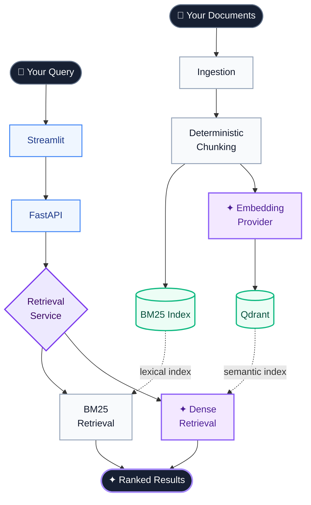
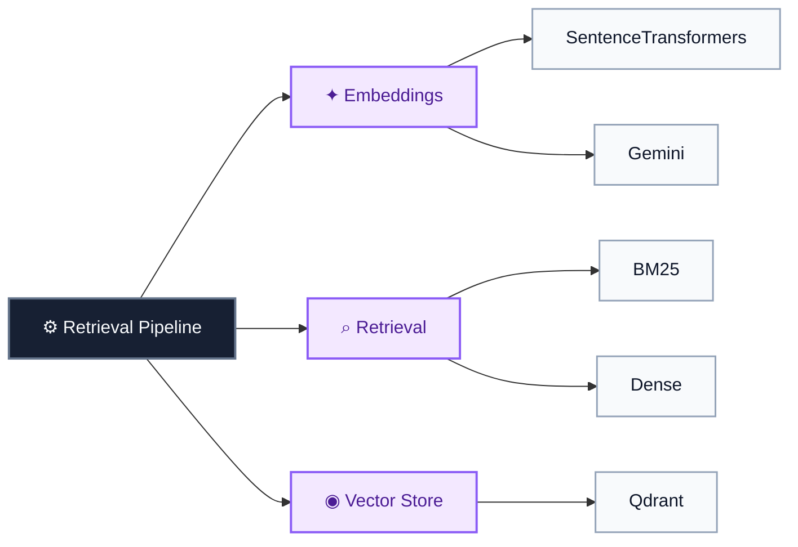

# SignalRank-RAG

[](https://github.com/bksampadi/SignalRank-RAG/actions/workflows/ci.yml)

[](https://github.com/bksampadi/SignalRank-RAG/releases)

**Reproducible retrieval, from documents to ranked results.**

SignalRank-RAG is an open-source, production-oriented RAG system combining deterministic document processing, lexical and semantic retrieval, configurable embeddings, vector search, observability, testing, and containerized execution.


**Python · FastAPI · Qdrant · BM25 · SentenceTransformers · Gemini · Logfire · Streamlit · Docker · CI**

## Architecture




The same deterministic chunks feed both lexical and semantic retrieval. Dense retrieval uses a configurable embedding provider and Qdrant vector storage, while the application layer exposes retrieval through a shared FastAPI service.

### AI & Software Engineering

SignalRank-RAG separates orchestration from implementation, keeping meaningful retrieval and AI components independently replaceable.



## Highlights

- Deterministic multi-format ingestion with document and chunk provenance
- BM25 lexical and dense semantic retrieval over the same chunk corpus
- Replaceable SentenceTransformer and Gemini embedding providers
- Qdrant vector storage with dimension validation and memory/local/remote modes
- FastAPI + Streamlit application layer with distributed Logfire tracing
- 35 automated tests, multi-platform CI, locked dependencies, and containerized execution


## Technical Overview

| Area | Implementation |
| --- | --- |
| **Ingestion** | TXT, Markdown, PDF, HTML, DOCX, PPTX, and XLSX |
| **Provenance** | Portable source references and deterministic document/chunk IDs |
| **Chunking** | Configurable size and overlap |
| **Lexical retrieval** | BM25 |
| **Dense retrieval** | Embedding-based semantic search |
| **Embeddings** | Provider protocol with SentenceTransformer and Gemini implementations |
| **Local embedding model** | `sentence-transformers/all-mpnet-base-v2` |
| **Cloud embedding model** | `gemini-embedding-2` |
| **Vector storage** | Qdrant with dimension validation |
| **Configuration** | Typed dataclasses backed by YAML |
| **API** | FastAPI |
| **UI** | Streamlit |
| **Observability** | Logfire distributed tracing |
| **Testing** | 35 automated tests |
| **CI** | Python 3.11–3.13 on Ubuntu and Windows |
| **Packaging** | `uv` with locked dependencies |
| **Runtime** | Docker and Docker Compose |

## Quick Start

The simplest way to run SignalRank-RAG is with Docker Compose.

```bash
docker compose up --build
```

Then open:

- **Streamlit UI:** `http://localhost:8501`
- **FastAPI documentation:** `http://localhost:8000/docs`
- **Health endpoint:** `http://localhost:8000/health`

The Streamlit UI and FastAPI backend run as separate services.

## Development

SignalRank-RAG uses [`uv`](https://docs.astral.sh/uv/) for Python environment and dependency management.

Install dependencies:

```bash
uv sync --extra eval
```

Run the test suite:

```bash
uv run --locked python -m pytest -v
```

Run FastAPI:

```bash
uv run uvicorn signalrank.api.main:app --reload
```

Run Streamlit in a second terminal:

```bash
uv run streamlit run src/signalrank/ui/app.py
```

By default, Streamlit expects the retrieval API at:

```text
http://127.0.0.1:8000
```

Override this with:

```text
SIGNALRANK_API_URL
```

## Configuration

Application behavior is configured through `configs/config.yaml`.

For example:

```yaml
chunking:
  chunk_size: 1000
  chunk_overlap: 200

embedding:
  provider: sentence_transformer
  model_name: sentence-transformers/all-mpnet-base-v2

retrieval:
  top_k: 5

qdrant:
  mode: local
  collection_name: signalrank_finewiki
  path: data/qdrant
```


Qdrant supports three execution modes:

```text
memory  → ephemeral in-memory storage
local   → persistent local storage
remote  → remote Qdrant / Qdrant Cloud
```

Deployment-specific endpoints and credentials are supplied through environment variables:

```text
GEMINI_API_KEY
QDRANT_URL
QDRANT_API_KEY
LOGFIRE_TOKEN
```
Do not store secrets in `config.yaml`.

## Observability

SignalRank-RAG uses Logfire for structured and distributed tracing across the retrieval path.

```text
Streamlit
    ↓
HTTP
    ↓
FastAPI
    ↓
Retrieval
    ↓
Embedding
    ↓
Qdrant
```


Manual spans record operational metadata including retrieval mode, embedding provider and dimension, collection, workload size, and execution timing. Raw query and document text is not intentionally attached to manual telemetry.

Logfire is optional. SignalRank-RAG can run without Logfire credentials.

## Project Structure

```text
SignalRank-RAG/
├── .github/
│   └── workflows/
│       └── ci.yml              Multi-platform CI
│
├── configs/                    YAML application configuration
├── data/                       Local datasets and vector-store data
├── scripts/                    Development and pipeline utilities
│
├── src/
│   └── signalrank/
│       ├── api/                FastAPI application
│       ├── components/
│       │   ├── chunking/       Deterministic document chunking
│       │   ├── data_ingestion/ Document discovery and loaders
│       │   ├── embeddings/     Embedding providers and factory
│       │   ├── retrieval/      BM25 and dense retrieval
│       │   └── vector_store/   Qdrant integration
│       ├── config/             Typed configuration loading
│       ├── pipelines/          Ingestion and indexing workflows
│       ├── services/           Application-level services
│       └── ui/                 Streamlit interface
│
├── tests/                      Automated test suite
│
├── .dockerignore
├── .gitignore
├── .python-version
├── compose.yaml
├── Dockerfile
├── LICENSE
├── pyproject.toml
├── README.md
└── uv.lock
```

## Current Status

`v0.1.0` established the initial retrieval foundation with deterministic ingestion, chunking, lexical and dense retrieval, Qdrant vector storage, API and UI layers, distributed tracing, automated testing, CI, and containerized execution.

Current development extends that baseline with configurable embedding providers, Gemini embeddings, model-aware vector dimensions, and configurable Qdrant execution modes.

## Roadmap

- [ ] Hybrid retrieval
- [ ] Reranking
- [ ] Evaluation framework
- [ ] Retrieval diagnostics
- [ ] Embedding model comparison
- [ ] Public deployment